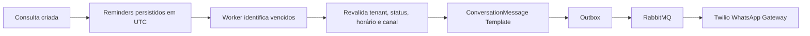

# Appointment Reminders — Production Setup

Os lembretes são persistidos em `clinic_assistant.appointment_reminders` e publicados pelo mesmo Outbox/RabbitMQ utilizado pelas mensagens WhatsApp. O Worker revalida a consulta antes de criar a mensagem Template, preservando o tenant e o `WhatsAppChannel` da clínica.

## Configuração

Configure no Railway **API e Worker** (Shared Variables ou em cada serviço):

```ini
AppointmentReminders__Enabled=false
AppointmentReminders__DayBeforeEnabled=true
AppointmentReminders__HourBeforeEnabled=true
Twilio__AppointmentReminder24hContentSid=HX_REPLACE_ME
Twilio__AppointmentReminder1hContentSid=HX_REPLACE_ME
```

Mantenha `Enabled=false` até os templates Twilio estarem aprovados, a migration aplicada e o smoke test concluído. Os SIDs nunca devem ser gravados no código ou em logs.

## Fluxo



Consultas criadas com menos de 24h/1h não recebem envio retroativo. Cancelamentos cancelam lembretes pendentes; reagendamentos cancelam os antigos e criam novos para o horário substituto. A chave lógica única impede duplicidade.

## Ativação segura

1. Crie e aguarde a aprovação dos dois templates.
2. Execute a migration `202608250003_AppointmentReminders`.
3. Configure os Content SIDs na API e no Worker.
4. Faça deploy e confirme logs de `AppointmentReminderDispatcher`.
5. Teste primeiro com `WhatsApp__Provider=Fake`.
6. Valide sender/canal por tenant e o histórico da conversa.
7. Altere `AppointmentReminders__Enabled=true` e monitore falhas, retries e dead letters.

O fuso da clínica é usado para apresentação; o instante persistido e agendado é sempre UTC. O número global `Twilio__WhatsAppFrom` não substitui o canal ativo da clínica quando há `WhatsAppChannel` configurado.
