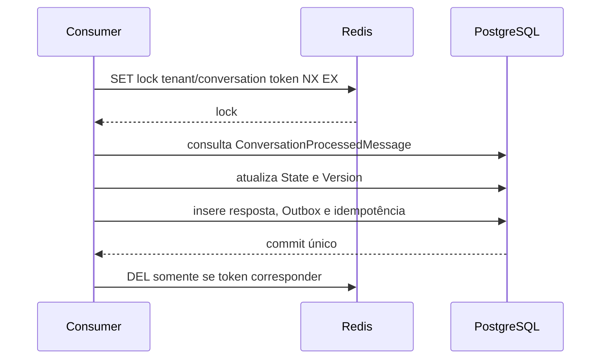

# Concorrência e idempotência

Redis coordena o processamento temporariamente, mas PostgreSQL é a fonte de verdade. `Conversation` e `ConversationState` usam `Version` como concurrency token. A chave única `TenantId + ConversationMessageId` impede uma segunda resposta quando o evento é reenviado.
