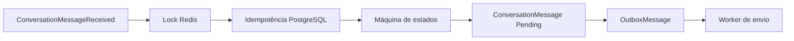
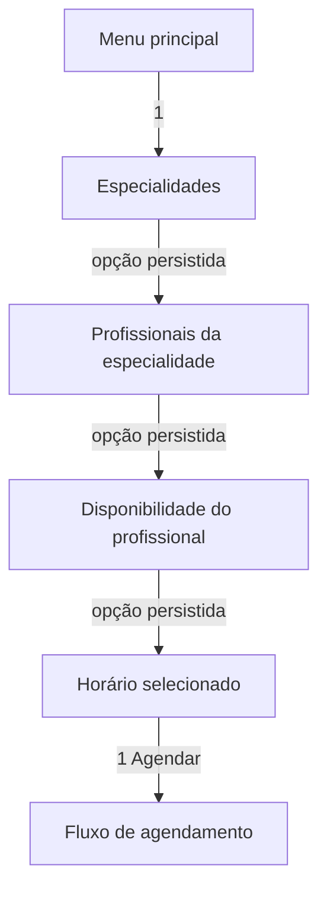

# Etapa 7 — Conversas e orquestração

## Fundação (7.1)

`Conversation` passa a ter modo de automação, prioridade e versão para concorrência otimista. O estado de atendimento, as opções apresentadas e a idempotência de mensagens possuem tabelas próprias e isoladas por tenant.

Nesta subetapa não há consumer de orquestração, máquina de estados, lock Redis ou resposta automática. Esses itens serão adicionados nas Subetapas 7.2 e 7.3.

## Processamento e resposta

O consumer e a máquina de estados foram adicionados nas Subetapas 7.2 e 7.3. A saída é persistida junto com a Outbox; nenhum componente de conversas chama o Twilio diretamente.

## Seleções contextuais

Opções numéricas são resolvidas sempre contra o estado e o snapshot persistido em
`conversation_options`. O mesmo `1` pode representar uma especialidade, um
profissional ou um horário, conforme a etapa atual; ele nunca é interpretado
novamente como opção do menu principal durante um subfluxo.

| Estado lógico | Entrada numérica | Próxima ação |
|---|---|---|
| Menu | `1` | Lista especialidades do tenant |
| Lista de especialidades | `1` | Persiste especialidade e lista profissionais vinculados |
| Lista de profissionais | `1` | Persiste profissional e solicita data/horários |
| Lista de horários | `1` | Persiste o intervalo real do horário |

O contexto persistido guarda os IDs e os nomes selecionados (`SelectedSpecialtyId`,
`SelectedSpecialtyName`, `SelectedProfessionalId`, `SelectedProfessionalName` e
`SelectedUnitId`).
Os comandos `menu`, `voltar`, `atendente` e `cancelar` têm prioridade explícita;
`voltar` retorna à etapa anterior e `menu` limpa as seleções transitórias.
As consultas de catálogo usam sempre `TenantId` da conversa e as opções expiram
com a política de estado já existente. Fake WhatsApp e Twilio passam pelo mesmo
orquestrador, lock Redis, idempotência e Outbox.

## Disponibilidade automática

Depois que o profissional é selecionado, o caminho principal consulta
progressivamente os próximos 14 dias, filtrando horários já passados e parando
ao atingir o limite configurado da conversa. Os resultados são ordenados e
agrupados pela data no fuso horário da clínica. O cursor do último horário
apresentado é persistido no contexto, permitindo `mais horários` sem repetir a
primeira janela. `outra data`, `hoje`, `amanhã` e datas explícitas continuam
disponíveis como fallback, sem obrigar o paciente a escolher uma data no happy
path.

Quando a data solicitada não tem mais vagas, o fluxo consulta novamente os
próximos dias antes de encerrar a tentativa. Se a janela inteira estiver vazia,
o paciente recebe alternativas numeradas para trocar profissional,
especialidade, informar uma data, falar com a recepção ou voltar ao menu.

Ao selecionar um horário, a conversa permanece pendente de confirmação. Cada
opção é gravada em `conversation_options` como um snapshot com profissional,
unidade e início/fim UTC; o número é apenas a posição exibida. Assim, a opção
5 é resolvida contra exatamente a lista que o paciente recebeu, sem recalcular
disponibilidade ou reordenar horários. A criação da consulta revalida o mesmo
intervalo, conflitos e unidade, mantendo a idempotência existente.

Na confirmação, as ações internas são separadas das etiquetas exibidas:
`ConfirmSelectedSlot`, `more_slots` e `mainmenu` são renderizadas como “Confirmar
agendamento”, “Mais horários” e “Voltar ao menu inicial”. A opção `confirm` do
menu principal resolve para `ConfirmExistingAppointment`, que é o fluxo de
consulta já existente. O estado persistido
usa `AwaitingSlotSelection` e `AwaitingScheduleConfirmation`; portanto, o
comando `1` após a escolha de um slot confirma o slot existente e nunca reinicia
o fluxo genérico de agendamento.

O limite padrão é de seis opções por mensagem (`Conversation:MaxOptionsPerMessage`).
`mais horários` avança o cursor persistido sem repetir a janela anterior. Se o
estado de confirmação estiver inconsistente (sem slot), o fluxo registra a
inconsistência e reconstrói a disponibilidade; ele não cai no handler de
consultas futuras.

Instantes de agenda permanecem em UTC no domínio, no PostgreSQL (`timestamptz`)
e na API (ISO 8601 com `Z`). A conversão para exibição usa explicitamente o
`Clinic.TimeZone`, tanto nas mensagens quanto no calendário web. Não há ajustes
fixos de horas nem dependência do timezone do container.

Para a experiência interativa/list-first, com IDs estáveis, fallback textual,
capabilities por canal e parsing do `ButtonPayload`, consulte
[`whatsapp-interactive.md`](whatsapp-interactive.md).
