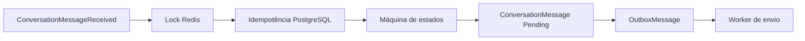

# Etapa 7 — Conversas e orquestração

## Fundação (7.1)

`Conversation` passa a ter modo de automação, prioridade e versão para concorrência otimista. O estado de atendimento, as opções apresentadas e a idempotência de mensagens possuem tabelas próprias e isoladas por tenant.

Nesta subetapa não há consumer de orquestração, máquina de estados, lock Redis ou resposta automática. Esses itens serão adicionados nas Subetapas 7.2 e 7.3.

## Processamento e resposta

O consumer e a máquina de estados foram adicionados nas Subetapas 7.2 e 7.3. A saída é persistida junto com a Outbox; nenhum componente de conversas chama o Twilio diretamente.
