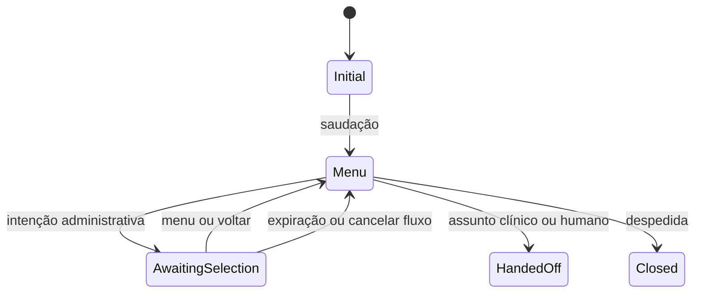

# Máquina de estados inicial

A classificação é determinística e administrativa. Perguntas sobre sintomas, diagnóstico, receita, medicamento ou tratamento sempre solicitam atendimento humano. A máquina retorna chaves de resposta; os textos são compostos separadamente por `IConversationResponseComposer`.
