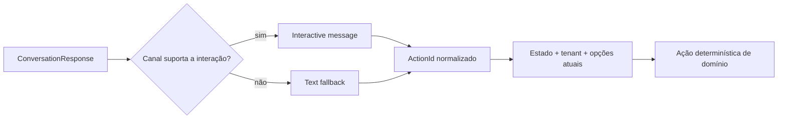
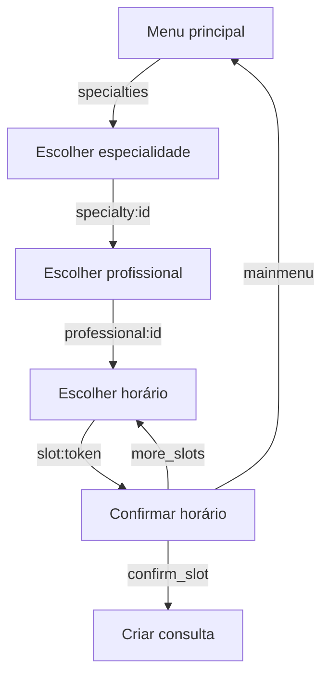

# WhatsApp interativo e fallback determinístico

## Objetivo

O paciente vê rótulos humanos e, quando o canal suporta a capacidade, toca em
uma opção. O backend recebe um `ActionId` estável, valida-o contra o estado e
as opções atuais da conversa e só então executa a ação de domínio. A mesma
resposta mantém um menu textual numerado para canais sem interação.



## Auditoria e decisão de arquitetura

| Área | Implementação atual | Reutilização | Lacuna/decisão |
|---|---|---:|---|
| Estado | `ConversationStateMachine` e contexto persistido | Sim | Continua sendo a fonte de verdade |
| Opções | `ConversationOptionDefinition` e `conversation_options` | Sim | `ActionId` opcional permite payload curto sem duplicar regras |
| Resposta | `IConversationResponseComposer` | Sim | Gera texto e `ConversationInteraction` a partir do mesmo conjunto |
| Gateway | `IWhatsAppGateway` | Sim | Expõe `WhatsAppGatewayCapabilities` e renderer provider-neutral |
| Twilio | `TwilioWhatsAppWebhookParser`/gateway | Sim | Lê `ButtonPayload`; hoje anuncia fallback textual para interativos |
| Fake | `FakeWhatsAppGateway` | Sim | Suporta listas e reply buttons para validação local |
| Outbox | `SendWhatsAppMessageCommand` | Sim | Campo interativo é opcional e mantém compatibilidade com mensagens antigas |

## Modelo de interação

`ConversationInteraction` possui tipo `List` ou `ReplyButtons` e uma coleção de
`ConversationChoice(ActionId, Label, Description)`. O domínio/aplicação não
conhece Twilio, `ContentSid` ou templates.

Os IDs são distintos do texto apresentado:

- menu/especialidade: `specialty:<guid>`;
- profissional: `professional:<guid>`;
- horário: `slot:<token-curto-determinístico>`; os dados completos (profissional,
  unidade e início/fim UTC) permanecem no snapshot da opção;
- confirmação: `confirm_slot`, `more_slots`, `mainmenu`.

No fallback, a posição (`1`, `2`, ...) é somente uma chave de apresentação e é
resolvida contra a mesma `ConversationOptionDefinition`. Um payload interativo
antigo ou desconhecido não é reinterpretado como menu principal.

## Fluxos cobertos



Especialidades, profissionais e horários usam listas; confirmação usa reply
buttons quando disponíveis. Mensagens informativas, sucesso, erro e handoff
continuam sendo texto livre.

## Capacidades do canal

O Fake anuncia listas, botões e texto. O gateway Twilio atualmente anuncia
`SupportsInteractiveLists = false` e `SupportsReplyButtons = false`, portanto
seleciona automaticamente o fallback textual e não bloqueia o happy path.
Essa decisão é intencional: a implementação não inventa payloads do provedor
nem exige aprovação de template para uma conversa já iniciada pelo paciente.

O [Twilio List Picker](https://www.twilio.com/docs/content/twiliolist-picker)
é um recurso do Content API e tem limites próprios; os [WhatsApp quick reply
buttons](https://www.twilio.com/docs/whatsapp/buttons) também dependem da
configuração de conteúdo/template conforme o cenário. Quando essa capacidade
for habilitada e validada na conta, basta alterar as capacidades/renderer do
gateway; a máquina de estados e os IDs permanecem iguais.

## Segurança, expiração e fallback

Antes de executar qualquer ação, o fluxo valida estado atual, tenant, conversa e
opção apresentada. O slot é revalidado contra disponibilidade e conflito antes
de criar a consulta. A janela de opções continua limitada por
`Conversation:MaxOptionsPerMessage` e `mais horários` preserva especialidade,
profissional, unidade e cursor.

O fallback é apenas de renderização/capacidade. Falhas de autenticação,
indisponibilidade do provedor ou erros de domínio continuam sendo reportadas e
não são mascaradas por um novo menu.

### Correção da confirmação

O fluxo de seleção de horário agora sempre persiste o estado como
`AwaitingScheduleConfirmation` quando há `SelectedSlotStartsAt` e grava somente
as duas ações do contexto (`confirm_slot` e `more_slots`) no conjunto atual de
opções. O comando textual global `menu` continua disponível em qualquer etapa
para sair do fluxo.
Antes, a transição `ScheduleAppointment` retornava uma resposta sem opções; o
composer então usava o texto padrão do menu principal e o próximo `1` não tinha
uma ação contextual persistida. A migration
`202608210001_InteractiveConversationOptions` também persiste `ActionId`, para
que tokens curtos de horário sobrevivam ao caminho Outbox → RabbitMQ → Worker.

Após a correção:

```text
1 → confirm_slot → revalida slot → cria consulta
2 → more_slots  → mantém especialidade/profissional → próxima página
menu → limpa contexto transitório → menu
```

O contexto só é limpo após sucesso, cancelamento explícito ou retorno ao menu.

### Disponibilidade em duas etapas

Quando o profissional é escolhido sem uma data explícita, a conversa primeiro
persiste e exibe somente os dias que possuem horários reais. Cada item usa um
identificador determinístico `day:yyyy-MM-dd`; a resposta numérica é resolvida
contra esse snapshot persistido, nunca por índice recalculado.

Depois da escolha do dia, o mesmo profissional é consultado apenas para aquela
data e os horários são exibidos em ordem crescente. A data e os horários são
derivados no fuso da clínica, enquanto os instantes continuam armazenados em
UTC. `mais horários` pagina o mesmo dia, `outros dias` retorna à lista de dias,
e `outra data` abre a entrada de data livre. Se o usuário já informou uma data,
o fluxo vai diretamente para os horários dessa data.

#### Causa raiz corrigida

Havia uma divergência entre as duas entradas que chegam ao mesmo estado: a
transição de `CheckAvailability` gerava opções de confirmação, mas a transição
de `ScheduleAppointment` retornava apenas texto. O composer, ao receber uma
resposta sem opções, aplicava o catálogo do menu principal; por isso o usuário
via `Como posso ajudar?` e o próximo `1` não era resolvido pelo mapa da
confirmação. As duas ramificações agora constroem o mesmo texto e o mesmo mapa
de ações antes de o estado e o Outbox serem persistidos.

Ainda não há `OptionSetId` protocolado no webhook Twilio; quando o provedor não
devolve esse identificador, a proteção usa o snapshot atual e a versão/estado
da conversa. Uma evolução futura pode adicionar versionamento explícito sem
alterar a abstração de interação.

## Testes e operação

Os testes unitários cobrem ações de especialidade, confirmação por reply,
fallback numérico e parsing de `ButtonPayload`. O Fake pode ser usado para um
smoke local sem credenciais. O smoke Twilio deve ser manual, com um número
autorizado, validando menu, especialidade, profissional, horário e confirmação;
se o gateway continuar sem capacidade interativa, o mesmo roteiro deve validar
o fallback textual.

Templates continuam reservados para notificações proativas, lembretes e
retomadas fora da janela de 24 horas; não fazem parte do happy path iniciado
pelo paciente.
