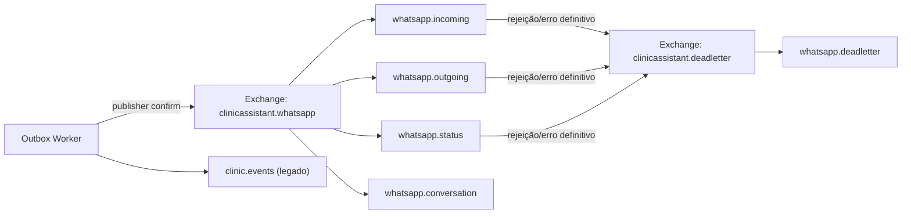
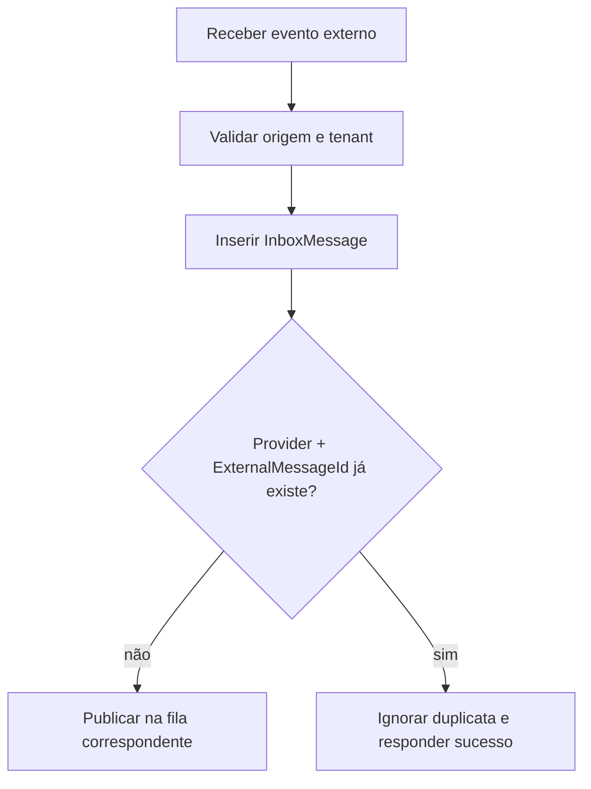

# Mensageria

Esta etapa estabelece a infraestrutura assíncrona do Clinic AI Assistant. O PostgreSQL permanece a fonte de verdade; RabbitMQ é o transporte de eventos.

## Topologia RabbitMQ



Todas as filas são duráveis. As mensagens publicadas pela outbox são persistentes e contêm `message-id`, `tenant-id`, `integration-id`, `correlation-id` e `trace-id`. O publisher só conclui após confirmação do RabbitMQ.

## Outbox

```mermaid
sequenceDiagram
  participant App as Caso de uso
  participant DB as PostgreSQL
  participant W as Worker
  participant MQ as RabbitMQ

  App->>DB: Salva estado de domínio + OutboxMessage
  DB-->>App: Commit único
  W->>DB: Busca OutboxMessage pendentes
  W->>MQ: Publica mensagem persistente
  alt confirmação do broker
    W->>DB: Marca OutboxMessage como Processed
  else falha
    W->>DB: Incrementa RetryCount e agenda NextAttemptAt
    Note over DB: Backoff: 30s, 2min, 10min; na 4ª falha, DLQ
  end
```

O estado da outbox só muda para `Processed` após a chamada de publicação concluir sem erro. Isso evita perder eventos quando uma transação de negócio já foi confirmada.

## Inbox e idempotência



O índice único `Provider + IntegrationId + ExternalMessageId` impede a reexecução do mesmo evento recebido. O webhook Twilio usa este fluxo.

## Estados de mensagens

| Estado | Significado |
| --- | --- |
| `Pending` | Aguardando publicação ou processamento. |
| `Processing` | Reservada por um worker. |
| `Processed` | Operação concluída. |
| `Failed` | Falhou, mas ainda pode ser retomada. |
| `DeadLettered` | Excedeu o limite de cinco tentativas. |

## Processamento de entrada

O consumer `WhatsAppIncomingMessageConsumer` usa acknowledgement manual e o prefetch configurável na fila `whatsapp.incoming`. Ele confirma apenas mensagens processadas ou duplicadas e encaminha payloads inválidos, falhas de isolamento ou de persistência à DLQ. A fila `whatsapp.conversation` preserva eventos `ConversationMessageReceived` para processamento futuro, sem chamar IA nesta etapa.

O consumer `SendWhatsAppMessageConsumer` consome `whatsapp.outgoing`. Ele resolve o gateway selecionado por configuração, persiste o `MessageSid` e confirma o comando somente após a atualização no banco. Nesta versão, somente comandos de texto são suportados; templates e mídia permanecem para as próximas subetapas.

Em ambientes que já tenham as filas WhatsApp da Etapa 5 declaradas com outro dead-letter exchange, aplique uma migração operacional de RabbitMQ (ou recrie apenas essas filas em desenvolvimento) antes da atualização, pois argumentos de filas duráveis são imutáveis.
