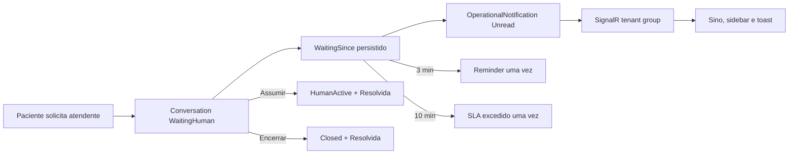

# Notificações da fila humana

## Escopo

A fila humana agora possui notificações in-app persistidas. Um handoff cria uma única notificação por conversa; mensagens posteriores não criam alertas duplicados. Ler o alerta não inicia atendimento: ele só é resolvido quando a conversa é assumida ou encerrada.

## Ciclo



## API

- `GET /api/notifications?page=1&pageSize=20`: histórico pendente paginado;
- `GET /api/notifications/summary`: `unreadCount`, `waitingCount`, `slaExceededCount` e `oldestWaitingSince`;
- `POST /api/notifications/{id}/read`: marca como lida, sem resolver;
- `POST /api/notifications/read-all`: marca todas como lidas.

Todas as rotas são protegidas e filtradas pelo tenant. Apenas `ClinicAdmin` e `Receptionist` recebem acesso operacional.

## Realtime e recuperação

O hub existente continua usando grupos `tenant:{id}`. O provider autenticado invalida o estado ao receber `human.handoff.requested`, `human.queue.reminder`, `human.queue.sla.exceeded` e `human.conversation.resolved`. O frontend também faz fetch inicial e polling de resumo, portanto não depende exclusivamente do SignalR.

## Configuração

```ini
HumanQueue__ReminderMinutes=3
HumanQueue__SlaMinutes=10
HumanQueue__PollingSeconds=30
```

Os defaults são 3, 10 e 30 segundos. O hosted service calcula o tempo a partir de `WaitingSince`, permitindo recuperação após reinício. A primeira versão não envia e-mail, SMS, WhatsApp, browser push ou LLM.

## Próxima fase

Business hours/feriados podem ser incorporados ao cálculo de SLA quando a regra operacional estiver definida. Browser Notification API/PWA push permanece deliberadamente fora desta versão.
