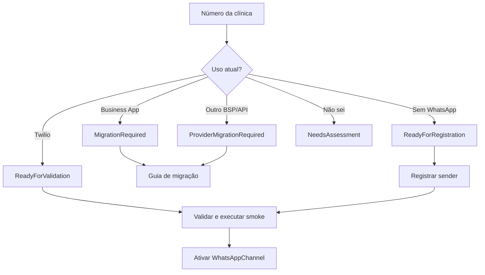

# Guia do PlatformAdmin — sender WhatsApp

## Cadastro

1. Abra **Plataforma** e selecione a clínica.
2. Em **Canais WhatsApp da clínica**, clique em **Adicionar número**.
3. Informe `Twilio`, telefone em formato internacional (`+...`) e o número de exibição opcional.
4. Salve. O canal será criado como `Pending`.

Uma clínica nova também pode receber o número no campo **Número WhatsApp da clínica** durante o onboarding.

## Como gerar e obter a `INTEGRATION_KEY`

A chave pertence à integração WhatsApp do tenant, não ao sender do Twilio. Ela é criada uma única vez e deve ser exclusiva por clínica.

Consulte a chave existente:

```sql
SELECT "IntegrationKey"
FROM clinic_assistant.whatsapp_integrations
WHERE "TenantId" = 'TENANT_ID_DA_CLINICA';
```

Se a integração ainda não tiver chave, gere uma fora do banco:

```bash
echo "wha_$(openssl rand -hex 16)"
```

Grave o valor gerado na integração por um procedimento administrativo controlado. Não substitua uma chave que já esteja configurada no Twilio, pois os webhooks antigos deixarão de funcionar. A chave não é o Account SID, o Auth Token ou o número do WhatsApp.

## Configuração no Twilio

No Twilio Console, abra **Messaging → Senders → WhatsApp Senders**, selecione o sender e configure ambos como **HTTP POST**:

```text
Inbound:
https://api.iarecepcao.com.br/api/webhooks/whatsapp/twilio/{INTEGRATION_KEY}

StatusCallback:
https://api.iarecepcao.com.br/api/webhooks/whatsapp/twilio/status/{INTEGRATION_KEY}
```

Substitua `{INTEGRATION_KEY}` pela chave da integração da clínica. Ela não é o Account SID nem o Auth Token.

## Ativação e teste

1. Volte à página da clínica e clique em **Validar**.
2. Corrija qualquer diagnóstico apresentado.
3. Clique em **Ativar** e confirme o status `Active`.
4. Envie uma mensagem do WhatsApp do paciente.
5. Confirme a conversa no tenant correto e responda pela aplicação.
6. Verifique o StatusCallback no Twilio.

Não exponha credenciais Twilio no frontend, na URL ou em logs. Um canal `Pending`, `Suspended` ou `Disabled` não deve enviar mensagens.

## Diagnóstico do número existente

Na página da clínica, use **Diagnóstico** e escolha o uso atual:

| Cenário | Resultado | Orientação |
| --- | --- | --- |
| WhatsApp Business no celular | `MigrationRequired` | Migrar/registrar o sender na WhatsApp Business Platform; não existe roteamento automático do app para a IA. |
| API/Platform por outro provedor | `ProviderMigrationRequired` | Planejar a migração do sender para a configuração Twilio. |
| Ainda não usa WhatsApp | `ReadyForRegistration` | Iniciar o registro do número como WhatsApp Sender. |
| Já configurado na Twilio | `ReadyForValidation` | Validar o sender e executar os smoke tests. |
| Não sei | `NeedsAssessment` | Confirmar o cenário no Meta Business Portfolio/WABA ou no provedor atual antes de ativar. |

Se a clínica não quiser migrar o número atual, há duas alternativas explícitas:

- manter o número no WhatsApp Business App e usar outro número para a IA Recepção;
- planejar a migração do número atual em uma janela controlada.

Não prometemos coexistência ou encaminhamento não suportado pelo provider.

## Checklist de readiness

Antes de ativar, o PlatformAdmin deve confirmar:

- [ ] número configurado e único;
- [ ] provedor definido;
- [ ] sender registrado;
- [ ] provedor online;
- [ ] webhook inbound configurado;
- [ ] outbound configurado;
- [ ] smoke inbound aprovado;
- [ ] smoke outbound aprovado.

### Fluxo de decisão



O Tech Provider/Embedded Signup, WABA e subconta Twilio por clínica permanecem como evolução futura. Nesta versão o PlatformAdmin conduz o onboarding manual com a conta Twilio compartilhada.
