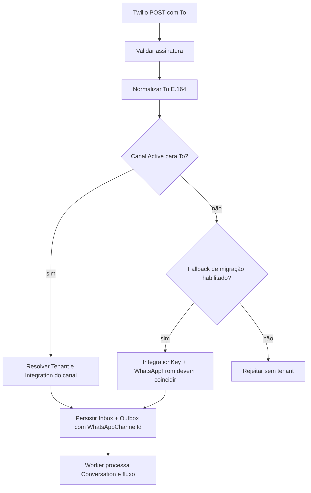
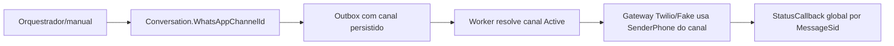

# WhatsApp multi-tenant por clínica

Esta versão permite que cada clínica/tenant tenha um sender WhatsApp próprio, mantendo `AccountSid`, `AuthToken` e demais segredos Twilio centralizados na infraestrutura. Nenhum segredo de provedor é armazenado no banco.

## Modelo e regras

`whatsapp_channels` identifica o número por `TenantId`, `NormalizedPhoneNumber`, provedor e status. O número é normalizado para E.164 sem o prefixo `whatsapp:`. O índice único impede que dois tenants usem o mesmo sender. `Conversation.WhatsAppChannelId` e `OutboxMessage.WhatsAppChannelId` preservam o canal escolhido, inclusive em mensagens pendentes.

Estados: `Pending` (cadastro incompleto), `Active` (pode receber/enviar), `Suspended` (bloqueado temporariamente) e `Disabled` (desativado). A migration é aditiva e não altera nem remove `whatsapp_integrations.WhatsAppFrom`.

## Fluxo inbound



O telefone do paciente nunca é usado para escolher o tenant. Um mesmo paciente pode existir em tenants diferentes sem cruzamento de dados.

## Fluxo outbound



Enquanto a migração estiver em andamento, `WhatsApp__MultiTenantChannelEnabled=true` usa o canal quando informado e mantém fallback restrito à integração conectada do próprio tenant. Não existe fallback para “primeiro tenant”.

## Administração

Somente `PlatformAdmin` pode administrar canais:

```text
GET  /api/platform/tenants/{tenantId}/whatsapp/channels
POST /api/platform/tenants/{tenantId}/whatsapp/channels
POST /api/platform/tenants/{tenantId}/whatsapp/channels/{channelId}/validate
POST /api/platform/tenants/{tenantId}/whatsapp/channels/{channelId}/activate
POST /api/platform/tenants/{tenantId}/whatsapp/channels/{channelId}/suspend
POST /api/platform/tenants/{tenantId}/whatsapp/channels/{channelId}/disable
```

Exemplo de criação:

```json
{
  "clinicId": "00000000-0000-0000-0000-000000000000",
  "unitId": null,
  "provider": "Twilio",
  "phoneNumber": "+15551234567",
  "displayPhoneNumber": "+1 555 123-4567",
  "integrationId": null,
  "isDefault": true
}
```

`ClinicAdmin` consulta o estado operacional, mas não altera sender, status ou integração. O onboarding pode criar clínica/unidade primeiro; o canal pode ser associado depois.

## Produção e rollback

1. Aplicar `202608240001_WhatsAppChannels` antes de habilitar novos senders.
2. Cadastrar o canal com `Pending`, validar e ativar após configurar o sender no Twilio.
3. Configurar o webhook inbound global e o StatusCallback global.
4. Validar um inbound e um outbound para cada tenant; conferir `TenantId`, `WhatsAppChannelId`, `From` e `To` nos logs.
5. Em rollback, definir `WhatsApp__MultiTenantChannelEnabled=false`; os canais permanecem preservados e o fallback legado continua disponível.

Nunca registrar `AuthToken`, conteúdo integral de payload ou credenciais em logs. Para Fake, use canais com `Provider=Fake` e valide os mesmos testes A/B.

## Validação local

```bash
dotnet restore backend/ClinicAssistant.sln
dotnet build backend/ClinicAssistant.sln --no-restore -p:UseSharedCompilation=false -p:BuildInParallel=false
dotnet test backend/tests/ClinicAssistant.UnitTests/ClinicAssistant.UnitTests.csproj --no-restore -p:UseSharedCompilation=false -p:BuildInParallel=false
cd frontend && npm test -- --run && npm run build
```

A migration pode ser aplicada pelo startup da API ou explicitamente com `dotnet ef database update`; em produção, execute-a em janela controlada e verifique a existência de `whatsapp_channels`, `conversations.WhatsAppChannelId` e `outbox_messages.WhatsAppChannelId` antes de ativar o flag.
