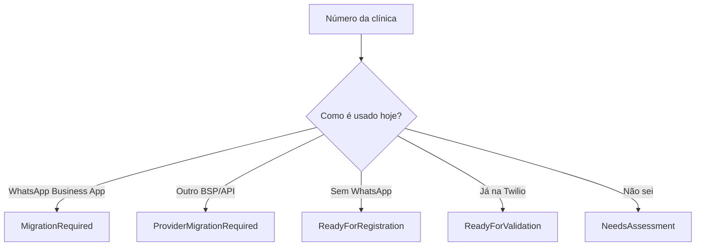
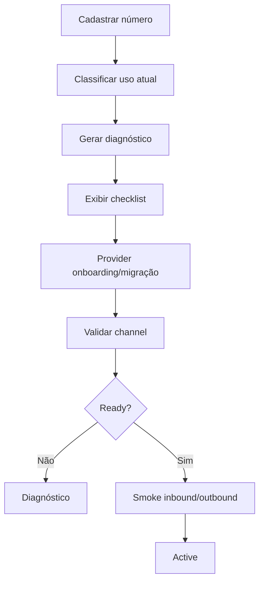
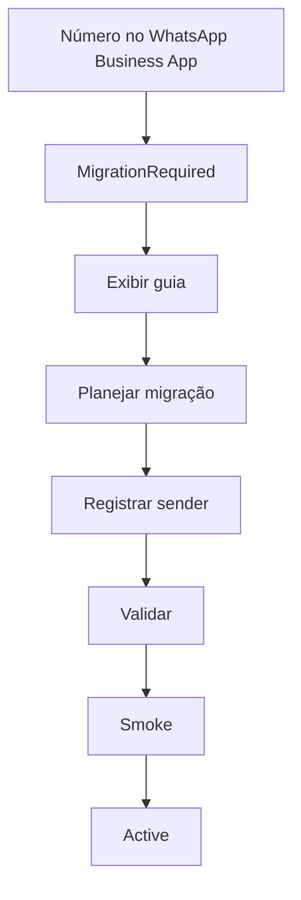

# Etapa 9.9.1 — Onboarding de número WhatsApp existente por clínica

## Objetivo

Amadurecer a Etapa 9.9 (`WhatsApp Multi-Tenant por Clínica`) para suportar o cenário comercial mais provável do MVP: a clínica já possui um número oficial divulgado aos pacientes e deseja utilizá-lo na IA Recepção.

Esta sub-etapa deve criar um onboarding guiado, seguro e transparente para o PlatformAdmin, deixando claro quando:

1. o número é novo e ainda não usa WhatsApp;
2. o número já usa WhatsApp Business App;
3. o número já está na WhatsApp Business Platform por outro provedor;
4. o número já está registrado na Twilio;
5. ainda não é possível ativar o número sem migração/registro no provider.

## Decisão arquitetural

Não criar uma "rota" fictícia de WhatsApp que faça mensagens de um número já registrado no WhatsApp Business App serem encaminhadas para a IA Recepção sem registro/migração.

Na arquitetura Twilio atual, o WhatsApp Sender precisa estar registrado na WhatsApp Business Platform via Twilio. Para números atualmente registrados no WhatsApp ou WhatsApp Business App, o fluxo suportado pela Twilio exige liberar/remover o número do app e registrá-lo como sender. Para números em outro provedor da WhatsApp Business Platform, deve existir migração do sender.

Portanto:

```text
Número da clínica
      |
      +--> já está no WhatsApp Business App
      |       |
      |       +--> MigrationRequired
      |
      +--> já está em outro BSP/API
      |       |
      |       +--> ProviderMigrationRequired
      |
      +--> não está registrado
      |       |
      |       +--> ReadyForRegistration
      |
      +--> já está na Twilio
              |
              +--> ReadyForValidation / Active
```

A aplicação deve explicar isso claramente no onboarding, sem prometer "roteamento" que o provider não oferece.

---

# 1. Relação com a Etapa 9.9

A Etapa 9.9 continua sendo a base:

```text
Tenant/Clinic
    |
WhatsAppChannel
    |
PhoneNumber
    |
Provider
```

A 9.9.1 acrescenta:

- origem do número;
- status de onboarding;
- decisão de migração/registro;
- tutorial guiado;
- diagnóstico;
- checklist;
- readiness para produção.

Não duplicar `WhatsAppChannel`.

---

# 2. Novos campos conceituais

Avaliar adicionar ao `WhatsAppChannel` ou entidade de onboarding equivalente:

```text
PhoneNumber
NormalizedPhoneNumber
Provider
Status
OnboardingStatus
NumberOrigin
CurrentWhatsAppUsage
ProviderSenderId?
WabaId?
TwilioSubaccountSid?       // futuro/Tech Provider, não obrigatório no MVP
LastValidationAt?
ValidationMessage?
ActivatedAt?
```

Enums conceituais:

```text
NumberOrigin
- ExistingClinicNumber
- NewNumber
- TwilioNumber

CurrentWhatsAppUsage
- None
- WhatsAppBusinessApp
- WhatsAppBusinessPlatformOtherProvider
- TwilioWhatsApp
- Unknown

OnboardingStatus
- Draft
- NeedsAssessment
- MigrationRequired
- ProviderMigrationRequired
- ReadyForRegistration
- RegistrationInProgress
- PendingVerification
- ReadyForValidation
- Active
- Error
- Suspended
```

Adaptar aos padrões do projeto e evitar enum excessivo se estados equivalentes já existirem.

---

# 3. Wizard de onboarding

Criar um wizard simples para PlatformAdmin.

## Etapa 1 — Número

Campos:

```text
Número WhatsApp da clínica
[ +55 81 99999-9999 ]
```

Normalizar E.164 no backend.

## Etapa 2 — Como esse número é usado hoje?

Opções:

```text
( ) Já usamos no WhatsApp Business no celular
( ) Já usamos uma API/WhatsApp Business Platform
( ) Ainda não usamos WhatsApp neste número
( ) O número já está configurado na Twilio
( ) Não sei
```

## Etapa 3 — Diagnóstico

Gerar uma orientação específica.

### WhatsApp Business App

Mostrar:

```text
Este número está atualmente associado ao WhatsApp Business App.

Para utilizá-lo como sender oficial da IA Recepção via Twilio,
será necessário seguir o processo de migração/registro suportado
pela Twilio/Meta.

Enquanto esse processo não for concluído,
o número não poderá receber as mensagens da IA Recepção via API.
```

Status:

```text
MigrationRequired
```

### Outro provider/API

Mostrar:

```text
O número já utiliza a WhatsApp Business Platform por outro provedor.

Será necessário migrar o sender para a configuração utilizada pela IA Recepção.
```

Status:

```text
ProviderMigrationRequired
```

### Número sem WhatsApp

Mostrar:

```text
O número está pronto para iniciar o registro como WhatsApp Sender.
```

Status:

```text
ReadyForRegistration
```

### Já na Twilio

Mostrar:

```text
Vamos validar se o sender está registrado e operacional.
```

Status:

```text
ReadyForValidation
```

---

# 4. Não prometer "rota sem migração"

O frontend e documentação NÃO devem usar termos como:

- redirecionar WhatsApp;
- encaminhar número para Twilio;
- criar rota do WhatsApp atual;
- manter WhatsApp Business App funcionando em paralelo;

a menos que a capacidade esteja explicitamente suportada pelo provider atual e validada documentalmente.

Usar:

```text
Registrar número
Migrar sender
Associar channel
Validar sender
Ativar channel
```

---

# 5. Cenário "quero manter o WhatsApp Business App"

Se a clínica não quiser migrar o número atual:

oferecer alternativa operacional:

```text
Opção A — manter número atual no WhatsApp Business App
           e usar outro número para IA Recepção

Opção B — planejar migração do número atual
```

Não implementar integração paralela não suportada.

---

# 6. Guia de implantação — Tutorial de onboarding

Criar página/documento:

```text
docs/whatsapp/clinic-number-onboarding-guide.md
```

ou padrão equivalente.

## Tutorial — Número atual da clínica

### Passo 1 — Identificar o cenário

Perguntar à clínica:

1. Qual o número?
2. Está no WhatsApp Business App?
3. Está em alguma API/BSP?
4. Quem administra o Meta Business Portfolio?
5. Existe WABA?
6. Existe verificação da empresa?
7. O número recebe OTP por SMS/voz?
8. A clínica aceita indisponibilidade/mudança operacional durante migração?

### Passo 2 — Registrar no IA Recepção

PlatformAdmin:

```text
Plataforma
→ Clínicas
→ Selecionar clínica
→ WhatsApp
→ Adicionar número
```

Preencher número e cenário atual.

### Passo 3 — Avaliar readiness

O sistema apresenta checklist:

```text
[✓] Número em E.164
[✓] Número não pertence a outro tenant
[ ] Meta Business Portfolio validado
[ ] Sender registrado
[ ] Provider validation
[ ] Webhook validado
[ ] Outbound validado
```

### Passo 4 — Provider onboarding

Se MVP/manual:

PlatformAdmin realiza processo Twilio fora da aplicação
e registra os IDs/status necessários.

Se Tech Provider estiver implementado futuramente:

usar Embedded Signup.

### Passo 5 — Validar channel

Botão:

```text
Validar canal
```

Validar:

- channel cadastrado;
- sender encontrado;
- sender/status válido;
- credentials globais;
- inbound configuration;
- outbound readiness.

### Passo 6 — Smoke test

Executar:

```text
Paciente autorizado
→ envia "Olá"
→ webhook resolve To
→ tenant correto
→ menu
→ resposta sai pelo mesmo sender
```

### Passo 7 — Ativar

Somente após smoke:

```text
Channel = Active
```

### Passo 8 — Monitorar

Conferir:

- último inbound;
- último outbound;
- última falha;
- status callback;
- logs;
- fila humana;
- notificações.

---

# 7. Guia de implantação — Número novo

Tutorial:

```text
1. Escolher número
2. Confirmar E.164
3. Registrar sender
4. Verificar OTP
5. Validar provider
6. Configurar webhook
7. Smoke inbound
8. Smoke outbound
9. Ativar
```

---

# 8. Guia de implantação — Outro provider

Tutorial:

```text
1. Identificar provider atual
2. Identificar WABA/Meta Business Portfolio
3. Validar 2FA/configuração exigida
4. Planejar migração
5. Registrar sender via Twilio
6. Confirmar assets migrados quando aplicável
7. Validar sender
8. Smoke inbound/outbound
9. Ativar
```

Não automatizar etapas externas sem API/fluxo oficial.

---

# 9. PlatformAdmin — Tela

Criar uma área:

```text
WhatsApp da clínica
```

Exemplo:

```text
Número
+55 81 *****9999

Uso atual
WhatsApp Business App

Onboarding
Migração necessária

Provider
Twilio

Status
Ainda não ativo

[Ver guia de implantação]
[Atualizar diagnóstico]
[Validar canal]
```

---

# 10. ClinicAdmin

ClinicAdmin deve visualizar somente o estado operacional:

```text
WhatsApp da clínica
Número: +55 81 *****9999
Status: Em implantação / Operacional
```

Não mostrar:

- AuthToken;
- AccountSid;
- migration internals;
- WABA IDs desnecessários.

---

# 11. Checklist de readiness

Criar componente reutilizável:

```text
WhatsAppReadinessChecklist
```

Itens conceituais:

```text
NumberConfigured
NumberUnique
ProviderConfigured
SenderRegistered
ProviderOnline
InboundConfigured
OutboundConfigured
SmokeInboundPassed
SmokeOutboundPassed
```

Não depender apenas de um boolean.

---

# 12. Validação automática possível

Automatizar apenas o que a API atual suportar.

Não inventar verificações.

Exemplo:

- format/uniqueness: automático;
- provider sender status: automático se Senders API configurada;
- Meta/WABA readiness: conforme dados/API disponíveis;
- inbound/outbound smoke: controlado.

---

# 13. Twilio Senders API

Auditar SDK/API atual antes de implementar.

Se apropriado:

- consultar sender por SID;
- consultar status;
- validar senderId;
- atualizar provider metadata.

Nunca chamar APIs com AuthToken no frontend.

---

# 14. Tech Provider — futuro preparado

A arquitetura deve ficar preparada para evolução:

```text
ClinicAdmin/PlatformAdmin
→ Conectar meu WhatsApp
→ Embedded Signup
→ Meta Business Portfolio
→ WABA
→ Twilio subaccount
→ Sender registration
→ WhatsAppChannel Active
```

Não implementar todo o Tech Provider Program nesta sub-etapa
a menos que o projeto já esteja preparado e isso seja explicitamente aprovado.

Documentar como Fase 2.

---

# 15. Subconta por cliente — não obrigatório agora

A documentação atual da Twilio para ISV/Tech Provider usa uma subconta Twilio por cliente/WABA.

Não alterar a arquitetura atual imediatamente.

Registrar como decisão futura:

```text
MVP:
conta/configuração Twilio atual + onboarding manual

Escala SaaS:
Tech Provider + Embedded Signup + subaccount por customer/WABA
```

---

# 16. Segurança

- mutations: PlatformAdmin;
- read operational: ClinicAdmin;
- tenant isolation;
- número único;
- WABA/provider IDs tratados como configuração técnica;
- secrets somente backend;
- logs sem secrets;
- audit de mudanças de número/status.

---

# 17. Auditoria

Registrar:

```text
WhatsAppChannelCreated
WhatsAppNumberAssessmentUpdated
WhatsAppMigrationMarkedRequired
WhatsAppChannelValidated
WhatsAppChannelActivated
WhatsAppChannelSuspended
WhatsAppChannelNumberChanged
```

Sem secrets.

---

# 18. Testes

## Unitários

- current usage -> onboarding status;
- Business App -> MigrationRequired;
- Other Provider -> ProviderMigrationRequired;
- None -> ReadyForRegistration;
- Twilio -> ReadyForValidation;
- unknown -> NeedsAssessment;
- number uniqueness;
- E.164.

## Integração

- create assessment;
- update assessment;
- validate channel;
- activate only when readiness rules pass;
- authorization;
- multi-tenant.

## Fake E2E

- existing-number assessment;
- new-number assessment;
- clinic A vs clinic B;
- channel activation;
- fallback legacy preserved.

## Regressão

Todos os fluxos conversacionais 1–7 da etapa anterior.

---

# 19. Documentação obrigatória

Criar/atualizar:

```text
docs/whatsapp/clinic-number-onboarding-guide.md
docs/whatsapp/existing-number-migration-guide.md
docs/whatsapp/new-number-guide.md
docs/whatsapp/provider-migration-guide.md
docs/whatsapp/whatsapp-channel-troubleshooting.md
docs/architecture/whatsapp-multitenant.md
```

Adaptar paths ao padrão real.

---

# 20. Fluxogramas Mermaid

## Decision tree



## Onboarding



## Existing Business App



---

# 21. Postman

Atualizar com:

```text
Create channel assessment
Update current usage
Get onboarding status
Validate channel
Activate channel
Suspend channel
Read readiness
```

Sem secrets reais.

---

# 22. UI premium do wizard

Requisitos:

- stepper simples;
- copy não técnica;
- diagnóstico claro;
- badges;
- checklist;
- "Ver guia";
- erro acionável;
- sem expor Twilio internals desnecessários.

Exemplo:

```text
Etapa 2 de 4
Como este número é usado hoje?

[ WhatsApp Business no celular ]
[ API/Plataforma WhatsApp ]
[ Ainda não usa WhatsApp ]
[ Já está na Twilio ]
[ Não sei ]
```

---

# 23. Copy — MigrationRequired

```text
Este número já está em uso no WhatsApp Business App.

Para utilizá-lo como canal oficial da IA Recepção via Twilio,
é necessário concluir o processo de migração/registro do número.

Sua clínica pode continuar configurando o restante da plataforma
enquanto essa etapa é preparada.
```

---

# 24. Copy — alternativa sem migrar

```text
Não quer migrar esse número agora?

Você pode manter o número atual no WhatsApp Business App
e utilizar outro número exclusivo para a IA Recepção.

Essa alternativa permite iniciar o piloto sem alterar
o atendimento atual da clínica.
```

---

# 25. Critérios de aceite

1. Onboarding distingue número novo/existente.
2. Business App não é tratado como "roteável".
3. Outro BSP gera migration path.
4. Número já Twilio gera validation path.
5. Guia de implantação completo disponível.
6. Checklist operacional disponível.
7. PlatformAdmin consegue acompanhar status.
8. ClinicAdmin vê status simples.
9. Nenhum secret exposto.
10. 9.9 continua funcional.
11. Fluxos conversacionais não sofrem regressão.
12. Docs/diagramas/Postman atualizados.
13. Não é prometida coexistência não suportada.
14. Alternativa "novo número para piloto" existe.
15. Tech Provider/Embedded Signup fica documentado como evolução.

---

# 26. Ordem de execução

1. Ler integralmente Etapa 9.9.
2. Auditar WhatsAppChannel implementado.
3. Auditar formulário atual.
4. Auditar provider integration.
5. Modelar assessment/onboarding status.
6. Migration aditiva se necessária.
7. API.
8. Authorization.
9. Wizard PlatformAdmin.
10. ClinicAdmin read-only.
11. Readiness checklist.
12. Provider validation.
13. Guides.
14. Mermaid.
15. Postman.
16. Tests.
17. Fake E2E.
18. Regression 9.9.
19. Twilio smoke onde possível.
20. Cleanup.
21. Relatório final.

---

# 27. Relatório final obrigatório

Informar:

1. arquitetura 9.9 encontrada;
2. mudanças 9.9.1;
3. decisão sobre "rota sem migração";
4. NumberOrigin;
5. CurrentWhatsAppUsage;
6. OnboardingStatus;
7. wizard;
8. readiness;
9. validation;
10. provider integration;
11. Business App path;
12. Other BSP path;
13. New Number path;
14. Already Twilio path;
15. PlatformAdmin;
16. ClinicAdmin;
17. migration;
18. authorization;
19. audit;
20. unit tests;
21. integration;
22. Fake E2E;
23. regression;
24. Postman;
25. docs;
26. Mermaid;
27. Twilio smoke;
28. risks;
29. manual operational steps;
30. Tech Provider future path.
