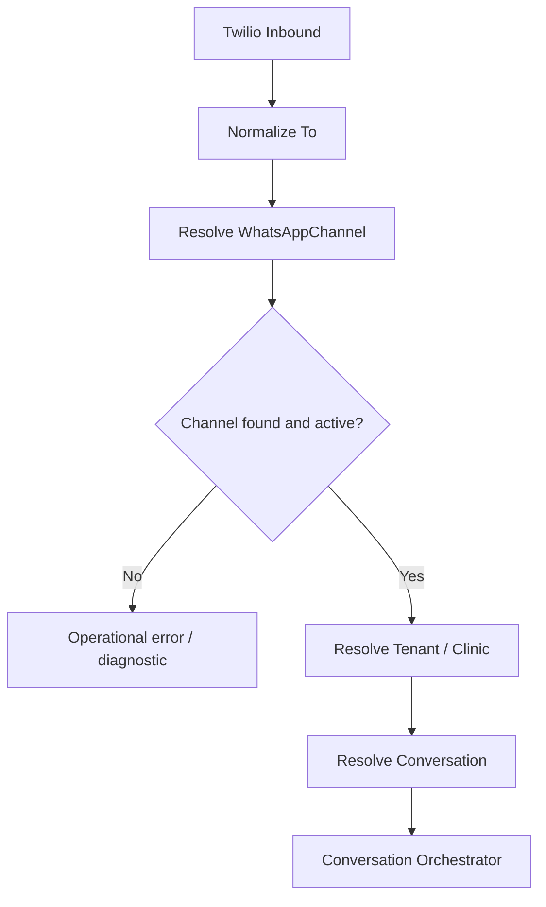
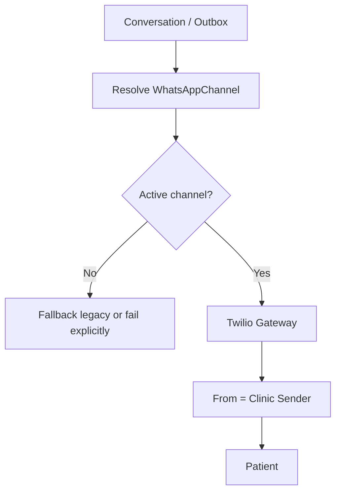
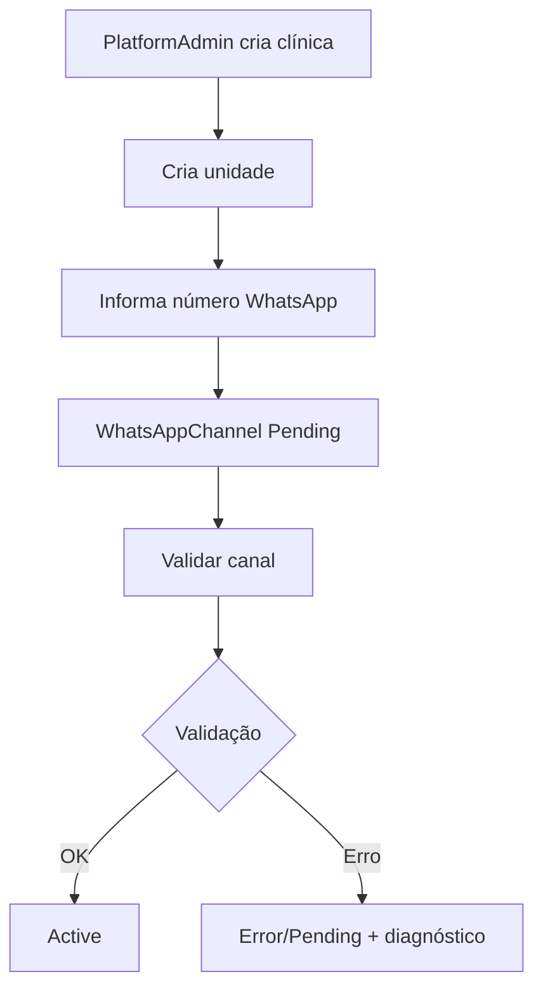
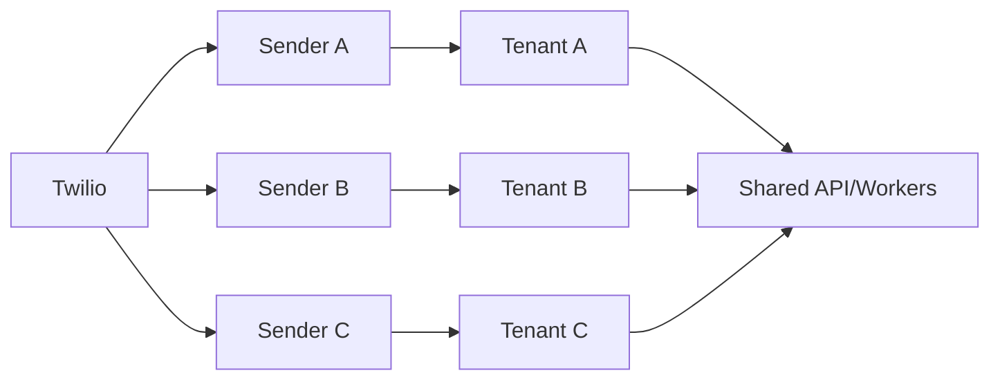

# Etapa 9.9 — WhatsApp Multi-Tenant por Clínica

## Objetivo

Evoluir a arquitetura atual da IA Recepção para suportar múltiplas clínicas/tenants, cada uma com seu próprio número de WhatsApp, mantendo o backend, worker, Redis, PostgreSQL, RabbitMQ/CloudAMQP, Twilio e demais componentes compartilhados.

A implementação deve preservar tudo o que já funciona hoje e remover gradualmente a dependência operacional de um único `TWILIO_WHATSAPP_FROM` global.

A partir desta etapa, o número de WhatsApp deve ser tratado como um recurso pertencente à clínica/tenant, e não como uma configuração global fixa da aplicação.

## Princípios obrigatórios

1. Não quebrar os fluxos conversacionais já estabilizados.
2. Não criar uma infraestrutura separada por clínica.
3. Manter uma única integração Twilio da plataforma nesta primeira versão.
4. Manter `TWILIO_ACCOUNT_SID`, `TWILIO_AUTH_TOKEN` e demais secrets globais fora do banco e fora da interface do ClinicAdmin.
5. O número da clínica deve ser configurável por formulário administrativo.
6. O domínio não deve depender do nome `TWILIO_WHATSAPP_FROM`.
7. O conceito de negócio deve ser `WhatsAppChannel`, `SenderNumber`, `PhoneNumber` ou equivalente.
8. Resolver o tenant do inbound pelo número que recebeu a mensagem (`To`).
9. Resolver o número de saída pelo tenant/conversa.
10. Preservar isolamento multi-tenant rigoroso.
11. Atualizar toda a documentação técnica, operacional, Postman e fluxogramas.
12. Implementar com compatibilidade gradual para reduzir risco em produção.

# 1. Arquitetura alvo

## 1.1 Visão geral

```text
                           Twilio
                              |
             +----------------+----------------+
             |                |                |
       Número Clínica A  Número Clínica B  Número Clínica C
             |                |                |
             +----------------+----------------+
                              |
                       Webhook único
                              |
                    WhatsAppChannelResolver
                              |
                    +---------+---------+
                    |         |         |
                 Tenant A  Tenant B  Tenant C
                    |         |         |
                    +---------+---------+
                              |
                    ConversationOrchestrator
                              |
             +----------------+----------------+
             |                |                |
          Agenda         Fila Humana        Outbox
```

Outbound:

```text
Conversation
    |
TenantId
    |
WhatsAppChannel ativo/default
    |
Outbox
    |
Worker
    |
TwilioWhatsAppGateway
    |
From = número da clínica
    |
Paciente
```

# 2. Modelo de domínio

Criar ou reutilizar uma entidade equivalente a `WhatsAppChannel`.

Campos conceituais:

```text
Id
TenantId
ClinicId
UnitId?                 // opcional, preparar sem obrigar uso agora
Provider                 // inicialmente Twilio
PhoneNumber
NormalizedPhoneNumber
DisplayNumber?
ProviderSenderId?
Status
IsDefault
CreatedAt
UpdatedAt
ActivatedAt?
DisabledAt?
LastValidationAt?
LastInboundAt?
LastOutboundAt?
```

Adaptar aos padrões atuais do projeto e não criar campos sem necessidade real.

# 3. Status do canal

Preferir status explícitos, por exemplo:

```text
Pending
Active
Suspended
Error
Disabled
```

ou equivalentes já existentes no domínio.

Evitar apenas `IsActive`, pois precisamos diferenciar configuração, operação, suspensão, erro e desativação.

# 4. Regras de negócio

## 4.1 Um número por clínica no MVP

Regra inicial:

```text
1 Clinic/Tenant -> 1 WhatsAppChannel principal ativo
```

Pode haver registros históricos/desabilitados, mas não pode existir ambiguidade sobre qual canal ativo/default usar para outbound.

## 4.2 Unicidade do número

Um número ativo não pode estar associado simultaneamente a duas clínicas diferentes.

Criar constraint/index adequado para `NormalizedPhoneNumber`, considerando a estratégia de status utilizada.

Em caso de conflito:

```text
Este número já está associado a outra clínica.
```

## 4.3 Formato

Persistir operacionalmente em E.164:

```text
+5581999999999
```

O frontend pode aceitar formato amigável. O backend deve normalizar e validar.

# 5. Configuração Twilio global

Manter secrets globais:

```text
TWILIO_ACCOUNT_SID
TWILIO_AUTH_TOKEN
```

e demais segredos do provider no ambiente seguro/Railway.

Não persistir esses valores em Clinic, Tenant, WhatsAppChannel, frontend, logs ou Postman versionado.

O PlatformAdmin configura apenas o número/canal da clínica.

# 6. Migração do TWILIO_WHATSAPP_FROM

Hoje existe ou pode existir lógica equivalente a `TWILIO_WHATSAPP_FROM`.

Essa variável não deve desaparecer abruptamente.

## Fase compatível

Outbound:

```text
if tenant possui WhatsAppChannel Active/Default:
    usar channel.PhoneNumber
else:
    usar TWILIO_WHATSAPP_FROM como fallback temporário
```

Inbound: se o número recebido ainda corresponder ao sender legado e não houver channel resolvido, usar estratégia de compatibilidade documentada apenas para o tenant legado.

## Fase final

Depois de migrar o tenant atual, validar produção, inbound/outbound, Outbox e Twilio real, remover o fallback global.

Registrar no relatório se o fallback foi mantido ou removido nesta execução.

# 7. Migration inicial

Criar migration segura.

Para ambientes existentes:

1. criar tabela/estrutura de WhatsAppChannel;
2. não remover colunas/configurações antigas ainda;
3. permitir aplicação subir sem dados novos;
4. se possível e seguro, criar o primeiro channel a partir da configuração atual;
5. se env não puder ser lida pela migration, criar procedimento de bootstrap/configuração;
6. nunca inserir secret na migration.

# 8. Resolução de tenant no inbound

Webhook Twilio típico:

```text
From = whatsapp:+55XXXXXXXXXXX
To   = whatsapp:+55YYYYYYYYYYY
```

Onde `From` é o paciente e `To` é o número da clínica.

Novo fluxo obrigatório:

```text
Inbound webhook
    |
normalize To
    |
WhatsAppChannelRepository
    |
Find Active Channel by NormalizedPhoneNumber
    |
TenantId / ClinicId
    |
Conversation
    |
Patient
    |
Orchestrator
```

Não resolver tenant pelo telefone do paciente.

# 9. Identidade da conversa

A mesma pessoa pode conversar com várias clínicas. Portanto, `PatientPhone != Tenant`.

Conceitualmente a identidade operacional deve ser algo como:

```text
TenantId + PatientPhone
```

ou:

```text
WhatsAppChannelId + PatientPhone
```

Auditar constraints existentes para evitar colisões cross-tenant.

# 10. Conversation

Avaliar adicionar `Conversation.WhatsAppChannelId` ou relacionamento equivalente.

Benefícios: outbound determinístico, histórico consistente, troca futura de número, múltiplos canais por tenant no futuro, rastreabilidade, callbacks e Outbox.

Não adicionar se já existe relacionamento equivalente.

# 11. Outbound multi-tenant

Eliminar dependência direta de sender global no fluxo normal.

Antes:

```text
TwilioWhatsAppGateway
    From = TWILIO_WHATSAPP_FROM
```

Depois:

```text
Conversation
    |
TenantId / WhatsAppChannelId
    |
resolve channel
    |
From = channel.PhoneNumber
    |
Twilio
```

O application layer não deve conhecer detalhes do Twilio.

# 12. Outbox

Auditar o contrato atual.

Idealmente persistir pelo menos:

```text
TenantId
ConversationId
WhatsAppChannelId
Destination
Payload
```

ou referência equivalente.

Se o número da clínica mudar depois que uma mensagem entrou na Outbox, uma mensagem pendente não deve silenciosamente sair pelo canal novo sem regra explícita.

Preservar backward compatibility dos registros pendentes.

# 13. Worker

Worker deve:

1. carregar a mensagem da Outbox;
2. identificar tenant/conversation/channel;
3. resolver o canal correto;
4. validar status;
5. enviar pelo gateway;
6. persistir status;
7. não alterar ConversationState indevidamente;
8. não compartilhar sender entre tenants de forma errada.

Criar testes para múltiplas clínicas no mesmo worker.

# 14. Status callbacks

Manter callback global, por exemplo:

```text
POST /webhooks/whatsapp/status
```

Preferir resolução por:

```text
MessageSid
    |
OutboundMessage
    |
Conversation
    |
Tenant / Channel
```

Não inferir tenant novamente por telefone se já houver relação confiável.

# 15. Webhook único

Não criar webhooks por clínica.

Manter webhook único e resolver tenant internamente, adaptando às rotas existentes.

# 16. Formulário PlatformAdmin

Adicionar número WhatsApp no onboarding/configuração da clínica.

Preferência:

```text
Plataforma
 -> Clínicas
   -> Criar/Editar Clínica
      -> Canal WhatsApp
```

Campos:

```text
Número WhatsApp da clínica
[ +55 81 99999-9999 ]

Provider
Twilio   // oculto ou somente leitura nesta primeira versão

Status
Pending/Active/... // leitura ou controlado pelo fluxo
```

Texto auxiliar:

```text
Este número será utilizado para receber e enviar mensagens da clínica.
```

# 17. UX do onboarding

O onboarding não deve ficar bloqueado completamente pelo WhatsApp.

Fluxo sugerido:

```text
1. Criar clínica
2. Criar unidade
3. Informar número WhatsApp, se já disponível
4. Salvar
5. Clínica fica "Em implantação/configuração"
6. Validar canal
7. Ativar quando pronto
```

A clínica deve poder configurar especialidades, profissionais, agenda e horários mesmo que o channel ainda esteja Pending.

# 18. PlatformAdmin

PlatformAdmin deve conseguir visualizar número, associar, editar antes da ativação, validar configuração, ativar, suspender, desativar, visualizar status e últimas atividades quando disponíveis.

Nunca mostrar AuthToken ou secrets.

# 19. ClinicAdmin

ClinicAdmin deve ter experiência simplificada e preferencialmente read-only para a infraestrutura do sender.

Exemplo:

```text
WhatsApp

Status: Operacional
Número: +55 81 *****9999
Última atividade: há 2 min
```

Pode manter `Verificar conexão` e `Enviar teste` se já forem seguros.

Recomendação: editar o número continua exclusivo de PlatformAdmin nesta primeira versão.

# 20. Validação do canal

Criar/reutilizar operação equivalente a `ValidateWhatsAppChannel`.

Validar channel, tenant/clinic, E.164, unicidade, provider, status, credenciais globais e configuração do gateway.

Resultado conceitual:

```text
Valid
PendingProviderConfiguration
InvalidNumber
DuplicateNumber
MissingPlatformCredentials
ProviderError
```

Adaptar ao domínio.

# 21. Teste controlado

Se já existe `Enviar teste`, adaptar para usar o channel da clínica.

Nunca usar sender global quando houver channel ativo.

Testar Clinic A -> sender A e Clinic B -> sender B.

# 22. Segurança

Obrigatório:

- PlatformAdmin para mutations de channel;
- ClinicAdmin read-only, salvo decisão explícita;
- tenant isolation;
- server-side authorization;
- não confiar em TenantId enviado livremente pelo frontend;
- não logar AuthToken;
- não logar payload sensível desnecessariamente;
- mascarar número em telas quando apropriado.

# 23. Multi-tenant tests

Criar cenário Tenant A/Sender A e Tenant B/Sender B.

Inbound `To = Sender A` deve resolver somente Tenant A.
Inbound `To = Sender B` deve resolver somente Tenant B.
Outbound Tenant A deve usar Sender A.
Outbound Tenant B deve usar Sender B.

Nunca cruzar.

# 24. Teste mesmo paciente em duas clínicas

Mesmo `PatientPhone` conversa com Clinic A e Clinic B.

Devem existir conversas/contextos independentes.

Não compartilhar state, appointment ou notifications.

# 25. Testes de channel status

Validar Pending, Active, Suspended, Disabled e Error conforme regras reais.

# 26. Troca de número

Cenário:

```text
Clinic A:
Sender antigo -> Disabled
Sender novo   -> Active
```

Mensagens novas usam novo sender.

Mensagens antigas na Outbox usam channel associado quando foram criadas, ou regra explícita documentada.

# 27. Redis

Não criar Redis por tenant.

Se houver cache para channel resolution, usar chave por normalized number e invalidar em update/activation/suspension/number change/disable.

Uma query indexada no Postgres é suficiente para o MVP.

# 28. PostgreSQL

Manter banco compartilhado multi-tenant.

Garantir índices adequados em `NormalizedPhoneNumber`, `TenantId`, `ClinicId`, `Status` e `IsDefault` conforme queries reais.

# 29. Réplicas / Railway

Não criar stack por tenant.

Continuar com infraestrutura compartilhada:

```text
API x N
Worker x N
Postgres
Redis
CloudAMQP
```

API e Worker devem permanecer preparados para escala horizontal.

Nenhuma regra de WhatsApp pode depender de memória local de uma instância.

# 30. FakeWhatsAppGateway

Atualizar Fake para suportar channel/sender por tenant.

Registrar TenantId, ChannelId, From, To e Message.

# 31. E2E multi-tenant

Criar E2E com Fake para Clínica A e Clínica B, validando tenant e sender corretos em inbound e outbound.

# 32. Regressão dos fluxos conversacionais

Executar regressão obrigatória:

```text
1 - Ver especialidades
2 - Ver profissionais
3 - Consultar disponibilidade
4 - Agendar consulta
5 - Reagendar consulta
6 - Cancelar consulta
7 - Falar com atendente
```

Também validar persona, human handoff, queue, notifications, agenda, realtime e callbacks.

# 33. SignalR

Não alterar sem necessidade.

Eventos continuam tenant-isolated.

# 34. Notificações da fila humana

Garantir isolamento por tenant na fila e notificações.

# 35. Templates

Não expandir esta etapa para reestruturar templates.

Apenas documentar que templates/provider configuration podem precisar de tratamento por channel/sender futuramente.

# 36. API

Auditar endpoints atuais e adaptar aos padrões existentes.

Recursos conceituais possíveis:

```text
GET    /platform/clinics/{clinicId}/whatsapp-channel
POST   /platform/clinics/{clinicId}/whatsapp-channel
PUT    /platform/clinics/{clinicId}/whatsapp-channel
POST   /platform/clinics/{clinicId}/whatsapp-channel/validate
POST   /platform/clinics/{clinicId}/whatsapp-channel/activate
POST   /platform/clinics/{clinicId}/whatsapp-channel/suspend
DELETE /platform/clinics/{clinicId}/whatsapp-channel
```

Não copiar cegamente; seguir padrões do projeto.

# 37. Idempotência

Evitar duplicações em create/activate/suspend/validate.

Webhook duplicado não cria múltiplas conversas/mensagens.

Outbound retry não usa channel errado.

# 38. Observabilidade

Adicionar logs estruturados seguros com TenantId, ClinicId, ChannelId, Provider, Direction, MessageSid, CorrelationId e Status.

Não logar AuthToken ou conteúdo sensível desnecessário.

Métricas, se já houver infraestrutura:

```text
whatsapp_channel_resolution_success
whatsapp_channel_resolution_failed
whatsapp_inbound_by_tenant
whatsapp_outbound_by_tenant
whatsapp_channel_validation_failed
```

# 39. Health / diagnóstico

Refinar diagnóstico para exibir:

```text
Configured
ProviderReady
ChannelActive
InboundReady
OutboundReady
LastInbound
LastOutbound
LastFailure
```

Sem expor credenciais.

# 40. Canal não encontrado no inbound

Se `To` não resolver channel:

- não selecionar tenant arbitrariamente;
- não usar primeiro tenant;
- não inferir pelo telefone do paciente;
- registrar erro seguro;
- retornar resposta HTTP apropriada ao provider;
- usar observabilidade/dead-letter conforme arquitetura.

# 41. Canal inválido no outbound

Se tenant não possuir active channel:

Durante compatibilidade, avaliar fallback legado.

Após remoção do fallback, falhar explicitamente e manter estado de retry/failure apropriado.

Nunca usar sender de outro tenant.

# 42. UI — formulário premium simples

No cadastro/edição da clínica:

```text
Canal WhatsApp

Número WhatsApp da clínica
[ +55 81 99999-9999 ]

Status
Em configuração

Este número será utilizado para receber e enviar mensagens desta clínica.
```

Se possível, usar máscara amigável, validação inline, feedback de duplicidade, badge de status e botão `Validar canal`.

# 43. Onboarding — fluxograma

```text
Criar clínica
    |
Criar unidade
    |
Informar WhatsApp
    |
Salvar
    |
Channel Pending
    |
Validar
   / \
  OK ERRO
  |   |
Active diagnóstico
  |
Clinic pronta para testes WhatsApp
```

# 44. Documentação obrigatória

Atualizar todo material afetado.

No mínimo, criar/atualizar documentação para:

1. arquitetura WhatsApp multi-tenant;
2. channel model;
3. inbound resolution;
4. outbound resolution;
5. onboarding;
6. PlatformAdmin;
7. ClinicAdmin;
8. migration/fallback;
9. security;
10. troubleshooting;
11. FakeWhatsApp;
12. E2E multi-tenant;
13. production setup;
14. rollback;
15. Twilio configuration.

# 45. Fluxogramas obrigatórios

Criar/atualizar Mermaid.

## Inbound



## Outbound



## Onboarding



## Multi-tenant



# 46. Postman

Atualizar collection e environments.

Adicionar fluxos para create/update channel, validate, activate, suspend, read, inbound Tenant A/B e outbound test Tenant A/B.

Não versionar secrets reais.

# 47. OpenAPI

Se existe requisito de OpenAPI versionado, atualizar schemas e endpoints relacionados.

# 48. README / Production

Explicar claramente:

Secrets globais:

```text
TWILIO_ACCOUNT_SID
TWILIO_AUTH_TOKEN
```

Sender por clínica:

```text
database / WhatsAppChannel
```

`TWILIO_WHATSAPP_FROM` deve ser documentado como fallback legado durante migração, ou removido conforme resultado final.

# 49. Rollback

Documentar rollback seguro.

Se multi-channel apresentar problema:

1. desabilitar feature flag/fallback, se implementado;
2. usar sender legado;
3. preservar dados de WhatsAppChannel;
4. não remover migration destrutivamente;
5. reverter aplicação sem perder conversas.

# 50. Feature flag

Avaliar:

```text
WhatsAppMultiTenantChannelEnabled
```

Quando false: comportamento legado.
Quando true: channel resolution.

Não manter duas arquiteturas permanentemente.

# 51. Testes unitários

Cobrir phone normalization, E.164, duplicidade, status rules, active/default resolution, channel by To, outbound by tenant, fallback, disabled/suspended channel e tenant isolation.

# 52. Testes de integração

Cenários de create/activate/resolve inbound/create conversation/enqueue outbound/worker/status callback/two tenants/same patient in two tenants.

# 53. Fake E2E

Executar cenário multi-tenant completo e validar conversations, appointments, TenantIds e outbound senders corretos.

# 54. Regression E2E

Executar todos os fluxos atuais no tenant legado e validar human queue, notification, manual human message, realtime e agenda.

# 55. Twilio smoke real

Após Fake e integração, testar controladamente o sender da clínica atual e, quando houver segundo sender disponível, validar segunda clínica.

# 56. Fora do escopo

Não fazer nesta etapa:

- infraestrutura Railway por clínica;
- banco por tenant;
- Redis por tenant;
- credenciais Twilio por clínica;
- bring-your-own-Twilio;
- múltiplos números por unidade em produção;
- refatoração completa de templates;
- LLM;
- nova mensageria;
- troca de provider.

# 57. Critérios de aceite

A etapa só está concluída quando:

1. `TWILIO_WHATSAPP_FROM` deixa de ser a fonte primária para tenants com channel configurado.
2. PlatformAdmin consegue cadastrar o número de uma clínica.
3. Número é validado/normalizado.
4. Número ativo não pode pertencer a duas clínicas.
5. Inbound resolve tenant pelo `To`.
6. Outbound usa sender da clínica.
7. Outbox preserva channel corretamente.
8. Worker suporta múltiplos tenants.
9. Mesmo paciente pode conversar com duas clínicas sem colisão.
10. ClinicAdmin não vê secrets.
11. Fake E2E multi-tenant passa.
12. Regressões atuais passam.
13. Documentação atualizada.
14. Postman atualizado.
15. Fluxogramas atualizados.
16. Rollback documentado.
17. Smoke Twilio legado passa.
18. Nenhum dado cross-tenant é exposto.

# 58. Ordem recomendada de execução

1. Auditar arquitetura WhatsApp atual.
2. Mapear todos os usos de `TWILIO_WHATSAPP_FROM`.
3. Mapear inbound/outbound/Outbox/worker.
4. Mapear configuration pages.
5. Criar modelo WhatsAppChannel.
6. Criar migration.
7. Criar repository/service.
8. Implementar normalization/validation.
9. Implementar uniqueness.
10. Implementar PlatformAdmin APIs.
11. Implementar formulário.
12. Implementar channel validation.
13. Implementar inbound resolver.
14. Implementar Conversation channel association.
15. Implementar outbound resolver.
16. Adaptar Outbox.
17. Adaptar worker.
18. Adaptar status callback.
19. Implementar fallback legado temporário.
20. Atualizar Fake gateway.
21. Unit tests.
22. Integration tests.
23. Multi-tenant Fake E2E.
24. Regressão completa.
25. Atualizar ClinicAdmin read-only view.
26. Atualizar observabilidade.
27. Atualizar Postman.
28. Atualizar OpenAPI.
29. Atualizar documentação.
30. Atualizar fluxogramas.
31. Documentar rollback.
32. Twilio smoke.
33. Cleanup de código legado possível.
34. Relatório final.

# 59. Relatório final obrigatório do Codex

Ao concluir, informar:

1. arquitetura anterior;
2. arquitetura final;
3. todos os usos encontrados de `TWILIO_WHATSAPP_FROM`;
4. quais usos foram removidos;
5. fallback mantido/removido;
6. modelo WhatsAppChannel;
7. migration;
8. indexes/constraints;
9. status model;
10. APIs PlatformAdmin;
11. formulário;
12. autorização;
13. ClinicAdmin view;
14. inbound resolution;
15. outbound resolution;
16. Conversation changes;
17. Outbox changes;
18. Worker changes;
19. status callbacks;
20. Fake gateway;
21. multi-tenant isolation;
22. same-patient multi-clinic test;
23. observability;
24. unit tests;
25. integration tests;
26. Fake E2E;
27. regression E2E;
28. Twilio smoke;
29. Postman;
30. OpenAPI;
31. docs;
32. fluxogramas;
33. rollback;
34. feature flag;
35. cleanup;
36. riscos restantes;
37. próximos passos recomendados.

# 60. Regra final

A evolução deve transformar:

```text
TWILIO_WHATSAPP_FROM = sender global
```

em:

```text
Tenant/Clinic
    |
WhatsAppChannel
    |
PhoneNumber/SenderNumber
```

sem criar infraestrutura isolada por clínica e sem quebrar os fluxos funcionais existentes.

A plataforma continua compartilhada.

O canal WhatsApp passa a ser multi-tenant.
