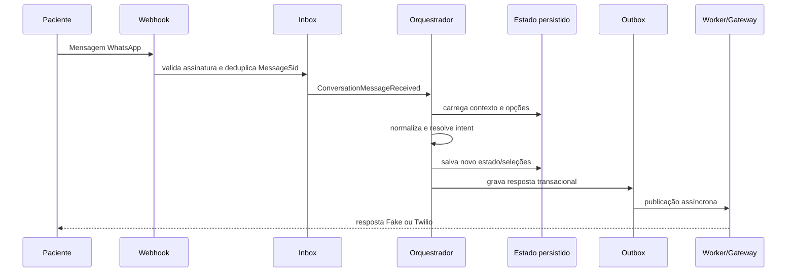
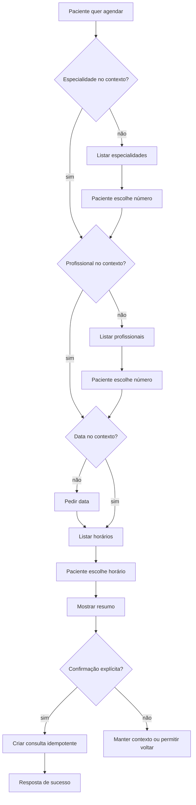
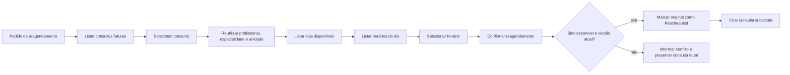

# Playbook de conversação WhatsApp

Este documento descreve as perguntas e respostas da automação do Clinic Assistant. Ele é a referência operacional para testes com Fake WhatsApp e para revisão do atendimento no Sandbox Twilio.

## Como a mensagem é processada



O webhook nunca envia diretamente ao provedor. Mensagens duplicadas são ignoradas pela Inbox e pelo registro de processamento da conversa.

## Abertura e menu

### Pergunta do paciente

Qualquer saudação, por exemplo:

- `oi`
- `olá`
- `bom dia`
- `quero ajuda`

### Resposta inicial

```text
Olá! 👋
Posso ajudar você com sua consulta.

Como posso ajudar?

1 - Ver especialidades
2 - Ver profissionais
3 - Consultar disponibilidade
4 - Agendar consulta
5 - Reagendar consulta
6 - Cancelar consulta
7 - Falar com atendente
```

Depois da abertura, a versão curta é usada:

```text
Como posso ajudar?

1 - Ver especialidades
2 - Ver profissionais
3 - Horários
4 - Agendar
5 - Reagendar
6 - Cancelar
7 - Atendente
```

## Fluxo de especialidades

### Perguntas reconhecidas

- `quais especialidades vocês têm?`
- `quero ver especialidades`
- `1` no menu principal

### Resposta

```text
Claro. Estas são algumas especialidades disponíveis:

1 - Cardiologia
2 - Dermatologia
3 - Pediatria
```

Os nomes vêm do catálogo ativo do tenant. O limite é controlado por `Conversation:MaxOptionsPerMessage`.

### Seleção

```text
Paciente: 1
Sistema: Encontrei a especialidade selecionada. Posso mostrar os profissionais ou consultar horários disponíveis.
```

O número `1` só representa a primeira especialidade nesse estado; ele não volta a significar “especialidades”.

## Fluxo de profissionais

### Perguntas reconhecidas

- `quais médicos atendem?`
- `quem atende cardiologia?`
- `quero ver os profissionais`
- `2` no menu principal

### Sem especialidade no contexto

```text
Qual especialidade você procura?
```

### Com especialidade no contexto

```text
Para Cardiologia, encontrei:

1 - Dra. Ana Souza
2 - Dr. Bruno Lima

Qual profissional você prefere?
```

O identificador técnico do profissional é persistido, mas nunca aparece na mensagem enviada ao paciente.

## Fluxo de disponibilidade

### Perguntas reconhecidas

- `tem cardiologista amanhã?`
- `quais horários estão disponíveis?`
- `tem vaga sexta?`
- `3` no menu principal

### Pergunta de data

Quando a data não estiver no contexto:

```text
Qual data você prefere? Você pode escrever, por exemplo, *amanhã*.
```

Datas determinísticas suportadas:

`hoje`, `amanhã`, `depois de amanhã`, `segunda`, `terça`, `quarta`, `quinta`, `sexta`, `sábado` e `domingo`.

### Resposta com horários

```text
Encontrei estes horários. Qual você prefere?

1 - 08:00 às 08:30
2 - 08:30 às 09:00
3 - 09:00 às 09:30
```

Os horários ocupados, bloqueados ou em férias não são exibidos.

## Fluxo de agendamento



### Exemplo completo

```text
Paciente: quero marcar uma consulta
Sistema: Escolha uma especialidade para começarmos:
         1 - Cardiologia
         2 - Dermatologia

Paciente: 1
Sistema: Encontrei estes profissionais. Qual você prefere?
         1 - Dra. Ana Souza

Paciente: 1
Sistema: Qual data você prefere? Você pode escrever, por exemplo, amanhã.

Paciente: amanhã
Sistema: Encontrei estes horários. Qual você prefere?
         1 - 08:00 às 08:30
         2 - 08:30 às 09:00

Paciente: 1
Sistema: Certo. Sua consulta será em 11/08 às 08:00. Posso confirmar o agendamento?

Paciente: sim
Sistema: Consulta agendada ✅
         Dra. Ana Souza
         11/08 às 08:00

         Se precisar, você pode escrever reagendar, cancelar ou menu.
```

`sim`, `confirmar`, `pode` e `ok` só confirmam quando existe uma confirmação pendente. Uma mensagem ambígua não cria consulta.

## Confirmar presença

### Entrada

- `vou comparecer`
- `quero confirmar minha consulta`
- `7` no menu

### Resposta com consultas

```text
Encontrei estas consultas pendentes. Qual você deseja confirmar?

1 - 13/08 às 16:00
```

Após a seleção:

```text
Encontrei sua consulta em 13/08 às 16:00. Deseja confirmar sua presença?
```

Após `sim`:

```text
Presença confirmada ✅

Esperamos você no dia 13/08 às 16:00.
```

Se já estiver confirmada:

```text
Essa consulta já está confirmada.
```

## Cancelar consulta

### Entrada

- `quero cancelar minha consulta`
- `não vou conseguir ir`
- `6` no menu

O sistema nunca cancela somente pela palavra “cancelar”. Primeiro lista a consulta e pede confirmação:

```text
Encontrei estas consultas. Qual você deseja cancelar?

1 - 15/08 às 14:00
```

```text
Encontrei sua consulta em 15/08 às 14:00. Deseja cancelar?
```

Após confirmação:

```text
Consulta cancelada ✅

15/08 às 14:00. Se precisar, é só escrever menu.
```

## Reagendar consulta

### Entrada

- `quero mudar meu horário`
- `preciso remarcar`
- `5` no menu



A lista inicial é filtrada por `TenantId`, paciente resolvido a partir do telefone
normalizado da conversa, data futura e status `Pending`/`Confirmed`. Cada opção
persiste o vínculo `posição → AppointmentId` no estado da conversa; a posição
digitada pelo paciente nunca é aplicada sobre uma nova consulta recalculada.
Depois da seleção, o fluxo mantém o profissional, a especialidade e a unidade da
consulta original e reutiliza o mesmo pipeline de disponibilidade do agendamento.
O botão/ação de confirmação é semântico (`confirm_reschedule`) e a mutation só
ocorre após essa confirmação explícita.

Resposta de conflito:

```text
Esse horário acabou de ficar indisponível. Vou manter sua consulta atual.
```

O fluxo valida a versão da consulta e não reinicia toda a conversa quando há conflito.

## Comandos globais

| Mensagem | Comportamento |
|---|---|
| `menu`, `início`, `voltar ao menu`, `começar de novo` | limpa a etapa e mostra o menu |
| `voltar`, `anterior` | retorna à etapa anterior |
| `cancelar operação`, `desistir`, `sair` | cancela o fluxo atual sem cancelar consulta |
| `atendente`, `humano`, `recepção`, `falar com alguém` | pausa automação e cria item na fila humana |
| `ajuda` | mostra orientação contextual |
| `repetir` | repete a orientação da etapa |

### Handoff humano

```text
Claro! Vou chamar alguém da recepção para você.

Sua conversa foi encaminhada para nossa equipe.
Aguarde um momento que alguém continuará o atendimento por aqui.
```

Depois do handoff, o Worker não envia novos menus automáticos enquanto a conversa estiver em modo `Human`. Mensagens do paciente são apenas persistidas e publicadas em tempo real para a equipe.

## Entradas desconhecidas e loops

Primeira entrada inválida:

```text
Não consegui identificar essa opção. Você pode escrever o que precisa ou escolher uma opção.
```

Nova falha:

```text
Ainda não consegui entender. Quer voltar ao menu ou falar com um atendente?
```

Ao atingir o limite configurado, a conversa é encaminhada para atendimento humano. O contador é persistido por etapa e não depende da memória do processo.

## Expiração

Quando o estado ultrapassa `Conversation:StateExpirationMinutes`:

```text
Vamos continuar por aqui. Como posso ajudar?
```

As seleções temporárias e confirmações pendentes são descartadas; nenhuma mutation é executada depois da expiração.

## Erros técnicos

O paciente nunca recebe stack trace, código HTTP, erro do banco ou código Twilio. Conflitos e falhas operacionais são convertidos em mensagens humanas e registrados em logs, auditoria e métricas.

## Checklist de validação

- [ ] saudação mostra o menu;
- [ ] linguagem natural identifica o fluxo;
- [ ] números funcionam de forma contextual;
- [ ] especialidade/profissional aparecem por nome;
- [ ] horários aparecem como hora, sem IDs;
- [ ] agendamento exige confirmação;
- [ ] cancelamento exige confirmação;
- [ ] reagendamento valida conflito e versão;
- [ ] `menu`, `voltar` e `atendente` funcionam em qualquer etapa;
- [ ] a opção `7` coloca a conversa em `WaitingHuman` e cria/reutiliza a fila;
- [ ] mensagens recebidas durante `WaitingHuman`/`Human` não acionam o bot;
- [ ] apenas o operador proprietário envia mensagens manuais pela Outbox;
- [ ] mensagem duplicada não executa a mutation duas vezes;
- [ ] respostas são publicadas pela Outbox/Worker.
